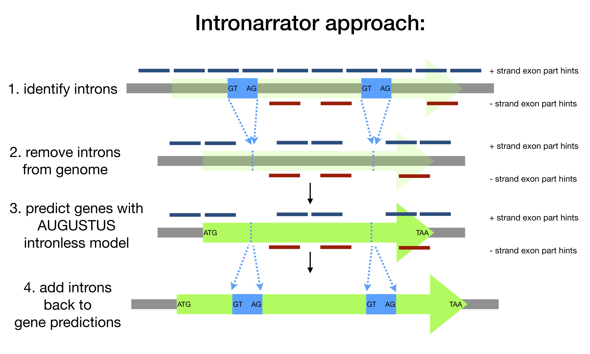

Description
===========

Intronarrator is a set of Python scripts that predict introns in genes using
RNA-seq data. The program AUGUSTUS is used to do the actual gene prediction,
using its "intronless" model. 

The motivation for this is that AUGUSTUS's intron model leads to poor prediction
of non-standard introns, such as the extremely short (mostly 15/16 bp) introns of
heterotrichous ciliates. Despite trying a number of options to alter this model,
we were unable to accurately predict introns - leading to most predicted introns  
being incorrect ("faketrons"). RNA-seq data, on the other hand, may be very
extensive -- providing deep coverage of most genes. Thus, it is possible to
predict the introns directly from RNA-seq data, and leave the rest of the gene
prediction to AUGUSTUS.

The approach is illustrated below: |approach|

Dependencies
============

The following programs need to be installed: AUGUSTUS, Infernal, tRNAscan-SE
version 2.0.

The following Python dependencies need to be installed: Numpy, BioPython, Pysam
if not present already.

All these depencies are listed in env.yml, allowing them to be installed by using conda.

Usage
=====

intronarrator.sh needs to be copied to the working directory. After this it
needs to be edited and properly setup before running, including setting
the paths to AUGUSTUS configuration files. You should also decide on the number
of parallel processes to run.

Helper scripts for producing stranded BAM files, and generation of "hints" for
AUGUSTUS from the BAM files are included in the directory "helper_scripts".
These should be copied and modified according to need before use.

